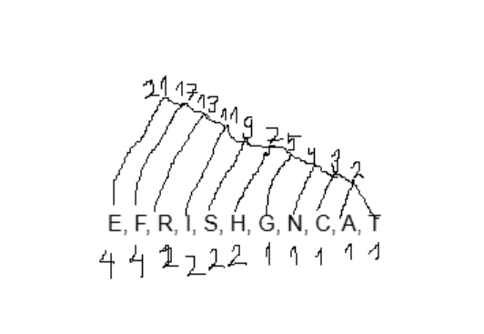
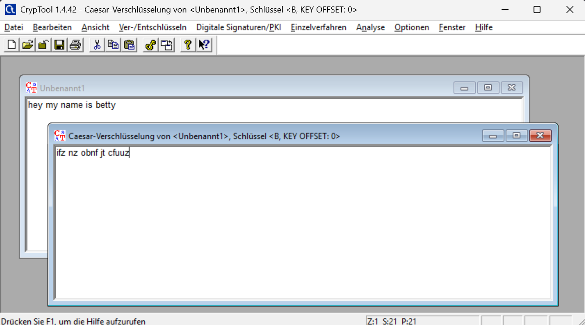
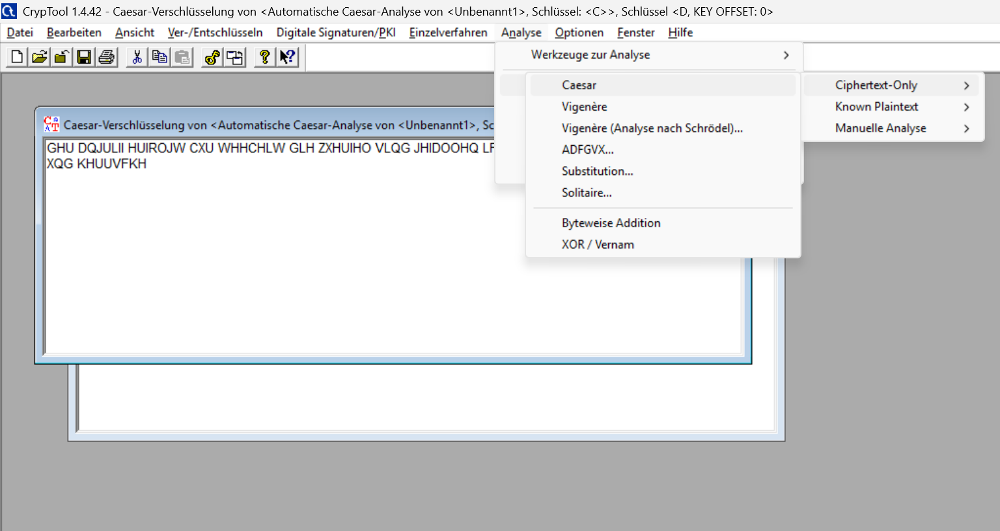
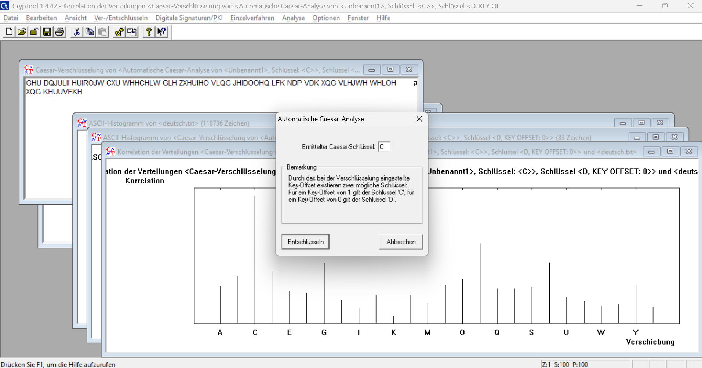
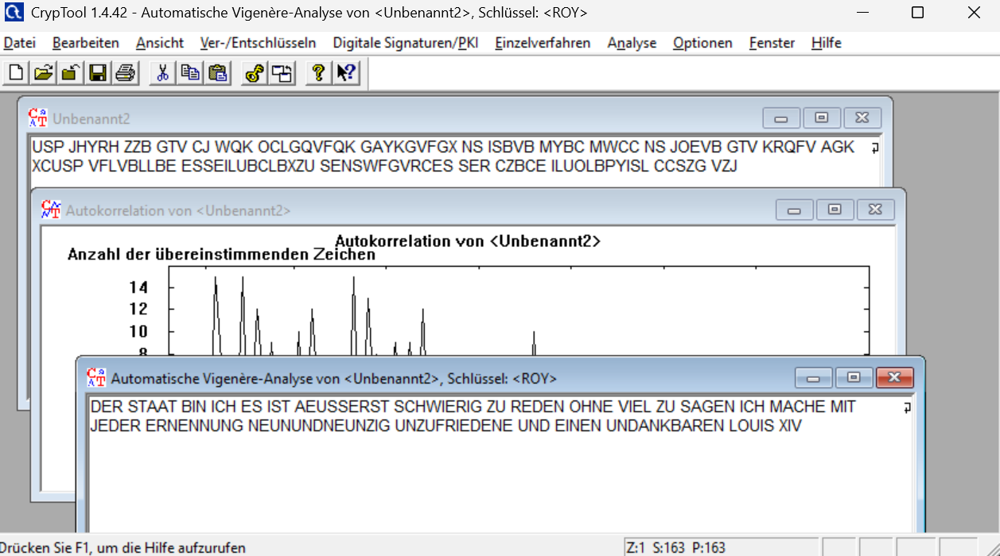

### Tag 1
Aufgabe 1:  
 1. Zwei tausendstel Millimeter = 2 * 10^-3 = 2m  
 2. 234 Milliarden Mikroliter in Liter = 234 * 10^-9 = 234n  
 3. 3.3 ZettaByte in Gigabyte wenns 25GB sind = (3.3 * 10^21) /25 = 1 320 000 000 000 000 000 000 Disks  
 4. Die unknown.unknown Datei Grösse ist 220KB. Die Grösse auf dem Disk beträgt 224KB.  
 Bei mir ist die Datei etwa gleich gross auf dem Disk wie die eigentliche Grösse. Es hat verschiedene Dateigrössen in dem Fall, weil die eigentliche Grösse kleiner als die auf dem Datenträger sein kann.  
 Ich habs nachgelesen, dass es weil Windows den Speicher in Blöcken verwaltet, die ein bisschen mehr Speicher brauchen.

 Aufgabe 2:  
 1. DWORD Kombinationen 2^32 = 4 294 967 296 Bit-Kombinationen
 2. WORD = 16 Bits -2^15 = -32 768 dezimaler Darstellung, 1000 0000 0000 0000 binäre Zahl
 3. WORD = 16 Bits = 2^16 = 65 535 dezimaler Darstellung, 1111 1111 1111 1111 binäre Form
 4. 2^9 Bit = 512 Bit-Kombinationen
 5. 2^20 Bit = 1 048 576 Bit-Kombinationen
 6. Log300 Treppenstufen / Log2 = 8,2 = 9 Bitstellen 

 Aufgabe 3:
 1. 0011 1100b = (0*2^7) + (0*2^6) + (1*2^5) + (1*2^4) + (1*2^3) + (1*2^2) + (0*2^1) + (0*2^0) = 32 + 16 + 8 + 4 = 60d
 2. 1010 1010b = 128 + 32 + 8 + 2 = 170d
 3. 1111 1111b = 128 + 64 + 32 + 16 + 8 + 4 + 2 + 1 = 255d
 4. 1Fh = 1*16^1 + 15*16^0 = 16 + 15 = 31d
 5. AAh = 10*16^1 + 10*16^0 = 160 + 10 = 170d
 6. 100h = 1*16^2 + 0*16^1 + 0*16^0 = 256 + 16 = 272
 7. 9d = 1001b
 8. 100d = 0110 0100b
 9. 127d = 0111 1110b

### Tag 2
Aufgabe 2:
- 00111111100000000000000000000000 = 1.0
- 
- 0.1 = 00111101110011001100110011001101 &rarr; doch man kann es umwandeln ins binäre
- 32Bit grösste GKZ = (2−2^−23)×2^127 = 3.4028235×10^38

### Tag 3
Aufgabe 1:

 ### Tag 4
 Aufgabe 2:
GREIFENSEE SCHIFFFAHRT  
Häufigkeit: G 1 / R 2 / E 4 / I 2 / F 4 / N 1 / S 2 / C 1 / H 2 / A 1 / T 1  
Nach Häufigkeit geordnet: E, F, R, I, S, H, G, N, C, A, T  
Binärer Baum:  

Binärer Code erstellen:

### Tag 6
Aufgabe 1:
1. - AES= is a symmetric block cipher. Symmetric-key algorithm meaning the same key is used for both encrypting and decrypting the data. (Advanced Encryption Standard)
    - DES= is a symmetric-key block cipher algorithm similar to AES just smaller, which uses a key of 56-bit size. (Data Encryption Standard)
    - IDEA= is a symmetric key block cipher encryption. IDEA uses a 128-bit key and operates on 64-bit blocks. (International Data Encryption Algorithm)
    - RC4= is a stream cipher, it uses either 64 bit or 128-bit key sizes. (Rivest Cipher 4)
    - XOR= cipher is an additive cipher, it combies plaintext with a secret key using the XOR, resulting in encrypted data that can only be decrypted using the same key. (Exclusive Or)
    - RSA= is a public-key cryptosystem to encrypt and a private key to decrypt. (Rivest, Shamir, Adleman) 
    - ECC using public and private keys for decryption and encryption (Elliptic Curve Cryptography)
    - SHA creates a hash to encrypt data. Usually uses algorithms TLS, SSL, PGP, SSH etc. (Secure Hash Algorithms)
2. Welche sind Blockchiffren? Antwort: AES, DES, IDEA

Aufgabe 2.1:
1. Here is an image of the tool and the encrypted sentence:

2. Encypted sentence: "GHU DQJULII HUIROJW CXU WHHCHLW GLH ZXHUIHO VLQG JHIDOOHQ LFK NDP VDK XQG VLHJWH WHLOH XQG KHUUVFKH"  
Decrypted sentence: "DER ANGRIFF ERFOLGT ZUR TEEZEIT DIE WUERFEL SIND GEFALLEN ICH KAM SAH UND SIEGTE TEILE UND HERRSCHE"  

3. Der Analyse-Tool zeigt wie oft ein Buchstaben vorkommt. Dann kann man bestimmen mit welchem Schlüssel verschlüsselt wurde und diesen entschlüsseln.  
Navigation to Analyse:

Entschlüsselung an sich selber:

Aufgabe 2.2:
1. Encrypt BEEf with keyword AFFE = BJJJ
2. Encrypt WRKXQT with keyword SECRET = OVMOUM
3. Entschlüsselter Text: "DER STAAT BIN ICH ES IST AEUSSERST SCHWIERIG ZU REDEN OHNE VIEL ZU SAGEN ICH MACHE MIT JEDER ERNENNUNG NEUNUNDNEUNZIG UNZUFRIEDENE UND EINEN UNDANKBAREN LOUIS XIV"

Aufgabe 2.3:
1. 