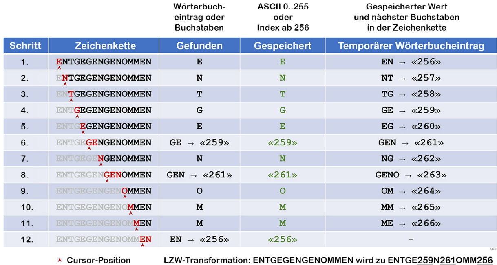

# m114

## Datenspeicher und Datenübertragung
Digital gespeicherte Daten, die übertragen werden, sind in der Form von **Bit**.
Bit ist entweder 1 oder 0.

- Byte &rarr; 8 bits
- WORD &rarr; 16 Bits
- DWORD &rarr; 32 Bits 
- QWORD &rarr; 64 Bits   
Dadurch ist die Anzahl Bit-Kombinationen ausrechenbar.

**Byte** Grosse B steht für Byte (100M**B**). Ein Byte entpricht zwei Hex-Ziffern. 1 Byte = 256 Bitkombinationen.  
**Bitkombinationen** Formel: **Anzahl Bit-Kombinationen = 2^Anzahl Bitstellen** (bitstellen sind wie viele Bits es sind) Beispiel 2^16 (16 sind eben bits) = 65'536 Kombinationen.  
Umgekehrt **Anzahl Bit** Formel: **Anzahl Bit = round it up(Log"Bit Kombination" / log2)** Kontrolle: **2^Anzahl Bit**  
**Zahlenkreis** 
Der Speicher hat bis zu 255 Byte Platz (= 1111 1111). Wenn es zu über 255 Byte kommt, kommt es zu einem Datenüberlauf. Daher bei 256 +1 Byte wächselt es zu 0 und ist beim Zahlenkreis wieder am Anfang. 

**Signed and Unsigned**   
By default ist alles positiv definiert  
&rarr; unsigned = positive Zahlen 0-255  
&rarr; signed = positive und negative Zahlen -128-127 weil das erste Zeichen der Vorzeihen (-/+) ist.  
unsigned overflow = binär ebene  
signed overflow = dezimal ebene    
n= Bit stellen
*Signed Formel*: (min) -2^(n-1), (max) 2^(n-1)-1
*Unsigned Formel*: (min) 0, (max) 2^n -1   

**MSB**: most significant bit = höchswertige Bit entweder 255 oder 127
**LSB**: least significant bit = niedrigstwertiges Bit entweder 0 oder -128

**Zahlensystem** bin &rarr; dez = (dez num)v10 = (binary number * 2^position of binary number) + (bv1 * 2^1) + (bv2 * 2^2)... so for 1011 it will be 1*2^3 + 0*2^2 + 1*2^1 + 1*2^0 = 8+0+2+1= 11  
dez &rarr; bin = the whole dez/2 rest is the binary numbers  | dez &rarr; hex = full dez num/16 devide each result until the rest is smaller than what youve been deviding by. Reverse Remainders und wandle um ins bin oder hex.  
bin &rarr; hex = from lsb add up the bin stellen zusammen 0111 = 0 4 2 1 = 7  
hex &rarr; dez = (n*16^3) + (n*16^2) + (n*16^1) + (n*16^0) potenz 0 gibt immer 1  
for hex to bin convert it first to dez.

## Codesysteme
Es hat vier Arten von Codes: Numerische (alles in Binärischen Codes dargestellt), Alphanumerische (Zeichen in Bitfolgen darzustellen), Strich-code (Code auf verpackungen) etc. Code muss Umgekehrabbildung nach der Umwandlung/Verarbeitung zurück geben.  

**Gleitkommazahlen** Gleitkommaformat ist in IEEE-754 Format. Vorzeichen, Exponent, Mantisse. Vorzeichen (-/+), Exponent 8 Bit lang, Mantisse 23 Zeichen. Exponent = signed, Exponent bias ist immer 127, weil es signed ist. Mantisse = unsigned (immer positiv).
  
**Alphanumerische Code** Dient dazu da um Text zu codieren.  
&rarr; ASCII-Code: 7 Bit-Zeichenkodierung welches 128 Zeichen darstellen kann (American Standard Code for Information Interchange) umfassen das lateinische Alphabet, Sonderzeichen usw.  
&rarr; Steuerzeichen (control characters) die wichtigsten zu merken sind: 08h= BS backspace, 09h= HT horizontal tab, 0Ah= LF line feed, 0Dh= CR carriage return, 1Bh= ESC escape, 20h= SP space, 30h= 0, 41h= A, 61h= a  
&rarr; ISO-8859 and ANSI Code: ISO-8859 braucht 8 Bits und kann 255 Zeichen darstellen, doppelt so viel wie ASCII. Es hat verschiedene versionen von ISO für alle verschiedene Sprachen.  
&rarr; Unicode UTF-8: Unicode kann maximal **4 Byte** lang sein. Verschiedene Zeichen im Bereich von U+00000000 bis U+FFFFFFFF. Unicode ist für alle denkbaren Zeichen dafür da. UTF-8 belegt pro Zeichen 1,2,3 oder 4 Byte. UTF-8 weniger speicheraufwendig. UTF-32 with 4 Bytes, UTF-16 2 or 4 Bytes, UTF-8 1-4 Bytes

UTF-8 uses some more complex characters. To know which character is not as simple as the ASCII characters we should look at the binary.  

**Vier UTF-8 Zeichen codes**: erster Byte ist ein Start-Byte in UTF-8. Fängt start-byte mit 0 one-byte Zeichen ist es ein einfaches ASCII Zeichen. Fängt es mit 110 two-byte Zeichen, 1110 three-byte Zeichen, 11110 four-byte Zeichen ist es ein Multi-byte Zeichen. 

**Byte-Reihenfolge LE, BE** BE= Big-Endian, wird nach dem höchstwertigen Byte zuerst gespeichert. LE= Little-Endian, wird nach dem kleinstwertigsten Byte gespeichert. UTF-8-LE-BOM (das heisst nach dem kleinsten Byte gespeichert)

**EAN-Code** schwarz weisse Balken Code, 8-stellige oder 13-stellige Zahl. Letzte Zahle ist die Prüfziffer.  
**EAN-8** Jede von den 8 Zahlen oder Zeichen besteht aus 7 gleich grossen Spalten (schwarz=1 weiss=0). Randzeichen 101 und Trennzeichen 01010. Die prüfziffer ist immer die letze.  
**QR-Code** Verlust von 7% der Daten auf dem QR-Code (verschmutzt oder was anderes) führt zu Fehlerkorrektur-Level L. Bei 30% Beschädigung ist es Fehlerkorrektur-Level H.

## Bildcodierung
PPI = pixel per inch  
DPI = dots per inch &rarr; beim Vierfarbendruck  
px= Pixel aus rot, blau, grünen Farbpunkten /
dot = bei Druckverfahren ein Farbpunkt entsteht Rastermuster mit verschiedenen Grössen und Anordungen.

**Farbräume** Farbe als Koordinatensystem oder mathematisches Modell dargestellt
Die 4 Farbräume sind:
- RGB (red, green, blue)
- CMYK (cyan, magenta, yellow, keycolor=black)
- HSL (hue=farbton, saturation=intensität, lightness)
- YUV (luminanz Y, chrominanz V,U)  
#FF0000 red, #00FF00 green, #0000FF blue, #FFFF00 yellow, #00FFFF cyan, #FF00FF pink, #000000 black, #FFFFFF white, #808080 grey

**Vektorgrafik** bestehen aus Linien, Kreisen und Kurven, die verlustfrei skaliert werden können (beliebig vergrössert werden) im Gegensatz zu Rastergrafiken. Oft für Fonts verwendet bei Bildschirmen oder Druckern.

**Alphakanal Transparenz** Alphakanal bedeutet Durchsichtigkeit der einzelnen Pixel. Dazu wird ein zusätzlichen Byte verwendet.  
Formate, die Alphakanal unterstützen: TIFF, TGA, PNG, PSD, GIF.

-------------------------------------------------------------------------------------------

unsigned: 1111 0000 = 1*2^7 + 1*2^6 + 1*2^5 + 1*2^4 + 0*2^3 + 0*2^2 + 0*2^1 = 240  
signed: 1111 0000 = -1*2^6 + -1*2^5 + -1*2^4 + 0*2^3 + 0*2^2 + 0*2^1 = -112  
-1*2^7 + 1*2^6 + 1*2^5 + 1*2^4

**signed: 0 = 0*2^7 + Rest welche auf 1 gesetzt sind | 1 = -1*2^7 + Rest welche auf 1 gesetzt sind**

TASK FROM ORIOL:
alles signed
0000 0000 = 0
1000 0000 = -1*2^7 = -128
1111 1111 = -1*2^7 + 2^6 + 2^5 + 2^4 + 2^3 + 2^2 + 2^1 + 2^0 = -1
1010 1010 = -1*2^7 + 0 + 2^5 + 0 + 2^3 + 0 + 2^1 + 0 = -86
0101 0001 = 0 + 2^6 + 0 + 2^4 + 0 + 0 + 0 + 2^0 = 81
1101 0110 = -1*2^7 + 2^6 + 0 + 2^4 + 0 + 2^2 + 2^1 + 0 = -42

Gleitkommazahl
Zahl 2.0 in IEEE 754 Single Precision darstellen

Vorzeichen 0
Vorkommazahl = 10
Nachkommazahl = 0

Zusammengesetzt = 10.0 * 2^0 -> 1.00*2^1
Exponent = 127 + 1 = 128 = 1000 0000
Mantisse = 23 Mal eine 0

0 1000 0000 23MAl 0

------------------------------------------------------------------------------------------

## Kompression
Kompressionsverfahren vor allem bei Bildern, ist wenn der urpsrüngliche Daten reduziert werden. Meistens um redundante Informationen zu entfernen. Umgekehrter Prozess ist Dekompression (Dekomprimierung).  
Verlustfreie Komprimierung, ist wenn alle Originaldaten zurück gewonnen werden können. Komprimierung = weniger Platz.

**Komprimierungsgrad bestimmen**:  
**Kompressionsrate K** = (Originalgrösse - Komprimierte Grösse) / OriginalGrösse  
**Kompressionsfaktor F** = Originalgrösse / Komprimierte Grösse

**VLC Variable Length Code** unterschiedlich Codelängen von Zeichen werden minimiert.  
Ein Beispiel davon ist der Morsecode da es meistens eine kürzere Codelänge für alle Zeichen gebraucht wird.  
Das andere wäre der Huffman-Code.

**Huffman-Code berechnen**  
Huffman-Code &rarr; Wort und Wort &rarr; Huffman-Code:  
Wort zu Huffman code muss man einen binären Baum erstellen. Dabei muss man eine Codetabelle haben.  
**Vorgehensweise**:
1. zuerst die Häufigkeit der Buchstaben zählen.
2. einen binären Baum erstellen nach der Häufigkeit, meistens links am häufigsten und rechts weniger häufigere Buchstaben
3. Buchstaben, die am wenigsten vorkommen, werden zu einem Knoten "^", man addiert zusammen die Häufigkeit
4. so geht man bis ganz zum letzten Buchstaben mit der grössten Häufigkeit
5. dann die Äste beschriften, nach links ist 1 nach rechts 0
6. dann erstellt man eine Codetabelle anhand dem Baum mit den binären Ästen  
**Wichtig** bei Punkt 3. muss man zuerst immer die kleinste Häufigkeit zuerst zusammen zählen.

**Umgekehrt**:
1. Falls du den Baum nicht hast, brauchst du die Codetabelle, um ihn wieder aufzubauen.
2. Starte von der Wurzel des Baums und bewege dich nach links (1) oder rechts (0), je nach nächstem Bit.
3. Sobald du ein Buchstabe erreichst, notiere den Buchstaben und springe zurück zur Wurzel.
4. Lies die nächsten Bits und wiederhole den Vorgang.  
Die Zahl: 0111001000100000111, zuerst geht es nach rechts (0) ist kein Buchstabe und dann zu (1) links, also das ist die erste Buchstabe, dann (1) mal nach links, ist schon die nächste Buchstabe, dann wieder das gleiche usw.

**RLC Run-Length-En/Coding**  
RLS ist eine Lauflängenkodierung. Es wird die Stelle markiert, wenn ein Symbol sich in der Nachricht verändert.  
**Vorgehensweise**:
1. auf jeder Linie Pixel durchzählen bis Wechsel. Wenn es auf der ersten und zweiten Zeile immer noch nur weisse gibt, dann diese Anzahl bis die schwarzen vorkommen.  
Beispiel: Ab erstem Pixel oben links: 31 x Weiss, 2 x Schwarz, 11 x Weiss, 3 x Schwarz, 2 x Weiss, 6 x Schwarz, 6 x Weiss, 6 x Schwarz, 1 x Weiss, 8 x Schwarz, 4 x Weiss
2. für jede Zeile wiederholen.
3. die grösste Zahl von allen in dem Fall 31 müssen wir in Binär darstellen. Um zu wissen wie viele Bits für die Zahl wir brauchen macht man: log(31 + 1) / log​(2) = 5 Bits
4. Anzahl bits pro Zahl von der Formel: 5 Bits. Alle andere Ziffern mit Bits darstellen
5. Die Zahlen im 5-Bit Binärcode (d.h. beginnt mit Weiss und jedesmal ein Wechsel): 11111 00010 01011 00011 00010 00110 00110 00001 01000 00100.

**LZW Lempel-Ziv-Welch**
0..255 Bits ASCII Zeichen, ab 256 Buchstaben ins Wörterbuch. Die Tabelle lautet: Zeichenkette, (Eingang von Text) Gefunden, Gespeichert, Temporärer Wörterbuch.  

## Verlustbehaftete Kompression  

Es kommt zu einem Datenverlust bei einer Kompression wenn beim Dekomrimieren entsteht das 100% Abbild des Originals nicht mehr.

**Komprimierungsverfahren** = die Reduktion der Bildgrösser oder der Farbigkeit.

**JPEG-Bildkomprimierung** Joint Photographic Experts Group. ISO/IEC 10918-1. JPEG Komprimierung erlaubt 90% Kompressionsrate ohne sichtbaren Informationsverlust. Eine Artifakte bei Bildkomprimierung sind sichtbare Unvollkommenheiten (imperfections), die beim rendering entstehen.  
Bei hoher Kompression treten folgende Nachteile auf: Unsaubere Textkonturen, Blockartefakte

Die 5 Schritte:
1. Umwandung des Farbraums / Color Space Conversion
2. Chrominanz Unterabtastung / Chrominance Downsampling
3. Diskrete Kosinus Transformation / Discrete Cosine Transformation
4. Quantisierung / Quantization
5. Zick-Zack & RLC & VLC 

**Luminanz** (Y) Luminanz beschreibt die Helligkeitsinformation eines Bildes. Wie hell oder dunkel ein Pixel ist.  
**Chrominanz** (Cr oder Cb) Chrominanz beschreibt die Farbanteile eines Bildes.Da das menschliche Auge Farbunterschiede weniger genau wahrnimmt als Helligkeitsunterschiede, können Chrominanz-Informationen stärker komprimiert werden. Ist die zentrale Technik in der JPEG-Komprimierung.  
**Cb** (Blue-Difference Chrominance): wie stark die Farbe Blau vom Helligkeitswert abweicht.  
**Cr** (Red-Difference Chrominance): wie stark die Farbe Rot vom Helligkeitswert abweicht.

**Der Prozess von JPEG-Kompressions-Verfahren**  
Ein wichtiger Schritt in der JPEG-Kompression ist die Umwandlung des Bildes vom RGB- in den YCrCb-Farbraum. Unterstützt True-Color. Ist verlustbehaftet komprimiert. Die Komprimierung erfolgt hauptsächlich durch Subsampling und Quantisierung (DCT).

**DCT** Diskrete Cosinus Transformation  
Ist eine der Haupttechniken der JPEG-Komprimierung und dient der Umwandlung von Bildinformationen in Frequenzbereiche zur besseren Datenreduktion.

**MPEG**  
Moving Picture Experts Group (MPEG). Die MPEG-Komprimierung basiert auf Intra- und Inter-Frame-Kompression.  
**Intra- und Inter-Frame-Kompression**  
Intraframe-Kompression reduziert die Bildinformationen ähnlich wie das JPEG-Verfahren.  
Interframe-Kompression wird durch die Differenzbildung von Bildbereichen erreicht.  

**GOP** = Group Of Pictures.  
Damit ist eine Bildgruppe gemeint, die mit einem Schlüsselbild (I-Frame oder Vollbild) beginnt. Danach folgen eine gewissen Anzahl B-Frames und P-Frames, bis wieder eine neue Bildgruppe mit startendem I-Frame folgt.

**I-Frame, P-Frame, B-Frame**
I-Frame → Intraframe-Kompression
P-Frame → Interframe-Kompression
I-Frame → Benutzt DCT zur Kompression
P-Frame → Benutzt nur DPCM zur Kompression
B-Frame → Benutzt bidirektionale Vorhersage zur differenziellen Kompression

## Verschlüsselung/ Kryptografie  
Kryptografie ist die Wissenschaft der Verschlüsselung, Informationssicherheit und der Widerstandsfähigkeit gegen Manipulationen. Verschlüsselung und Entschlüsselung = encryption and decryption.

**Chiffre** Geheimcode/Algorithmus, der verwendet wird, um Daten zu verschlüsseln oder entschlüsseln.  
**Blockchiffre (block cipher)** wird in Blöcken unterteilt. Schlüssellänge 64, 112, 128, 168 Bit. Es verschlüsselt den Schlüsselwert miteinander in ganzen Datenblöcken. Blockchiffre sind robuster und sicherer als Stromchiffre. **DES, AES, IDEA**  
**Stromchiffre (stream cipher)** entschlüsselt Nachrichten Bit für Bit bzw. Zeichen für Zeichen. Für Echtzeitübertragungen dafür da. **RC4, OFB, SEAL, A5/1**  

- AES= is a symmetric block cipher. Symmetric-key algorithm meaning the same key is used for both encrypting and decrypting the data. (Advanced Encryption Standard)
- DES= is a symmetric-key block cipher algorithm similar to AES just smaller, which uses a key of 56-bit size. (Data Encryption Standard)
- IDEA= is a symmetric key block cipher encryption. IDEA uses a 128-bit key and operates on 64-bit blocks. (International Data Encryption Algorithm)
- RC4= is a stream cipher, it uses either 64 bit or 128-bit key sizes. (Rivest Cipher 4)
- XOR= cipher is an additive cipher, it combies plaintext with a secret key using the XOR, resulting in encrypted data that can only be decrypted using the same key. (Exclusive Or)
- RSA= is a public-key cryptosystem to encrypt and a private key to decrypt. (Rivest, Shamir, Adleman) 
- ECC using public and private keys for decryption and encryption (Elliptic Curve Cryptography)
- SHA creates a hash to encrypt data. Usually uses algorithms TLS, SSL, PGP, SSH etc. (Secure Hash Algorithms)  

Mit dem selben Schlüssel verschlüsseln und entschlüsseln heisst Symetrische Verschlüsselungsverfahren.  

### Symetrische Verschlüsselungen

**Cäsar-Verschlüsselung** (Rotationschiffre) jede lateinische Buchstaben des Alphabets wird **um N Stellen rotiert oder besser gesagt ersetzt**. Beispiel ROT-13, es verschieben sich Buchstaben um 13 nächsten Buchstaben. Cäsar Verschlüsselung ist monoalphabetischen Chiffrierverfahren, weil durch die selben Buchstaben ersetzt wird.

Mit dem **CrypTool** zu **entschlüsseln**, Text eingeben. In den Tabs "Analyse/Symetrische Verschlüsselung (klassisch)/Cipher-Text Only/Caesar or whatever the algorithm is/Entschlüsseln where the Ermittelter Caesar-Schlüssel ist"

**Vigenere-Verschlüsselung** ist ein polyalphabetisches Chiffrierverfahren, weil ein Buchstaben wird mit verschiedenen Buchstaben chiffriert. Daher ist es auch schwieriger zu entschlüsseln als Cäsar.  
Ein Schlüssel, der meistens gleich lang wie der Klartext (plain understandable text) ist. Entschlüsseln mit einem Vigeneren-Quadrat, der Konzept, ist den Kreuzungspunkt zwei Buchstaben zu finden.
Der selbe Key/Schlüssel beim Absender und Empfänger.

**XOR-Stromchiffre** Exklusive-Oder-Verschlüsselung ist einfach und kann bei komplexeren Verfahren angewendet werden. Bit-für-bit ver-/entschlüsselt. Der Sender und Empfänger benutzen den selben Schlüssel in Form von binären Code. 
XOR: A 0 0 1 1 | B 0 1 0 1 | Y 0 1 1 0  
Sich das vertikal vorstellen. 00= 0, 11= 0, 01= 1, 10= 1  
